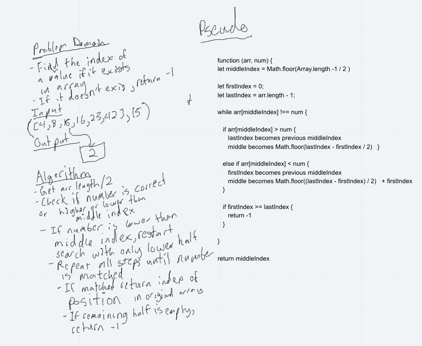

# Binary Search

### **[LINK TO CODE](https://github.com/alex-whan/data-structures-and-algorithms/blob/master/javascript/challenges/arrayBinarySearch/array-binary-search.js)**

## Challenge

Write a function called `binarySearch` which takes in 2 parameters: a sorted array and the search key. Without utilizing any of the built-in methods available to your language, return the index of the array’s element that is equal to the search key, or -1 if the element does not exist.

## Approach & Efficiency

### Example

      Input	--> Output
      ([4,8,15,16,23,42], 15)	--> 2
      ([11,22,33,44,55,66,77], 90) --> 1

## Solution

