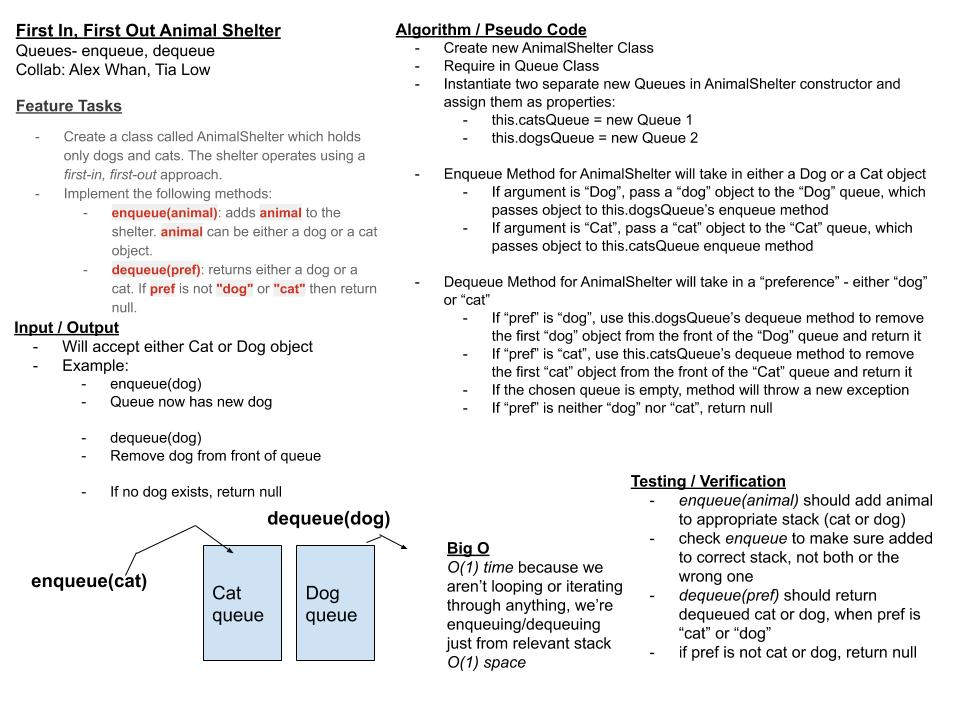

# First-In/First-Out Animal Shelter

### **[LINK TO CODE](https://github.com/alex-whan/data-structures-and-algorithms/blob/master/javascript/challenges/fifoAnimalShelter/fifo-animal-shelter.js)**

## Challenge

Create a class called `AnimalShelter` which holds only dogs and cats. The shelter operates using a first-in, first-out approach.

Implement the following methods:

- `enqueue(animal)`: adds animal to the shelter. animal can be either a dog or a cat object.
- `dequeue(pref)`: returns either a dog or a cat. If pref is not "dog" or "cat" then return `null`.

## Approach & Efficiency

### Big O Time:

O(1)

- No loops or iterations - only simple `enqueue` and `dequeue` methods that feed into the `enqueue` and `dequeue` methods of the `Queue` class.

### Big O Space:

O(1)

- Two instantiations of `Queue` class

## Diagrams & Solutions

### Whiteboard

