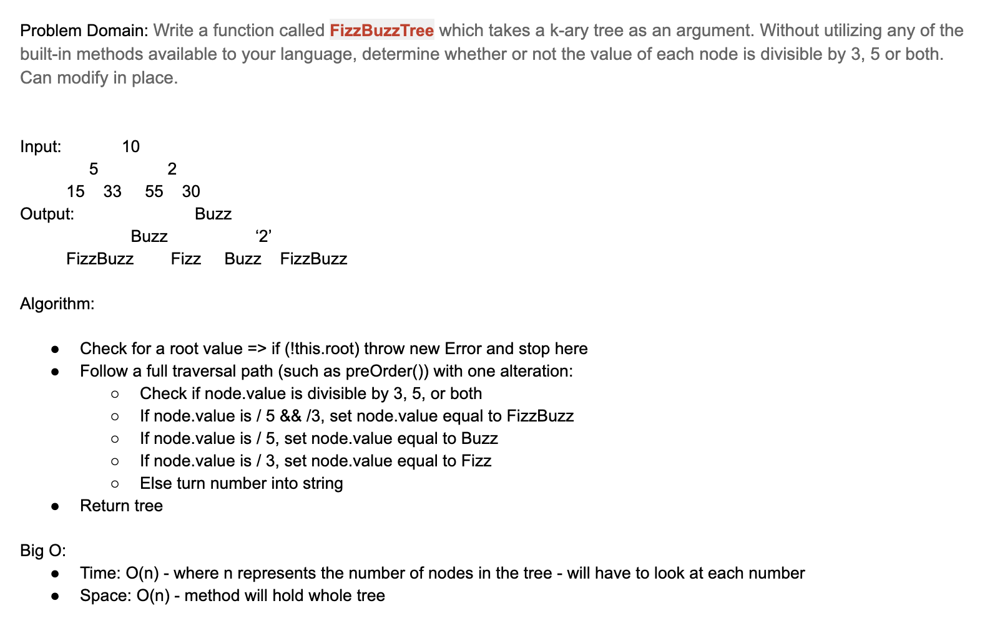

# FizzBuzz Tree

### **[LINK TO CODE](https://github.com/alex-whan/data-structures-and-algorithms/blob/master/javascript/challenges/fizzBuzzTree/fizz-buzz-tree.js)**

## Challenge

Conduct “FizzBuzz” on a k-ary tree while traversing through it to modify the tree in place. Set the values of each of the new nodes depending on the corresponding node value in the source tree.

Write a function called `FizzBuzzTree` which takes a k-ary tree as an argument. Without utilizing any of the built-in methods available to your language, determine whether or not the value of each node is divisible by 3, 5 or both. Keep the same tree structure as the original, but with the values modified as follows:

- If the value is divisible by 3, replace the value with “Fizz”
- If the value is divisible by 5, replace the value with “Buzz”
- If the value is divisible by 3 and 5, replace the value with “FizzBuzz”
- If the value is not divisible by 3 or 5, simply turn the number into a String.

## Input/Output Examples

**Input:**

              10

          5          2

      15     33  55     30

**Output:**

              Buzz

          Buzz       2

      FizzBuzz Fizz Buzz FizzBuzz

## Approach & Efficiency

### Big O:

- Time: O(n)

  - Worst-case scenario is (n) number of nodes in the tree

- Space: O(n)

  - Worst-case scenario is (n) number of nodes in the tree

## Diagrams & Solutions

### Whiteboard

