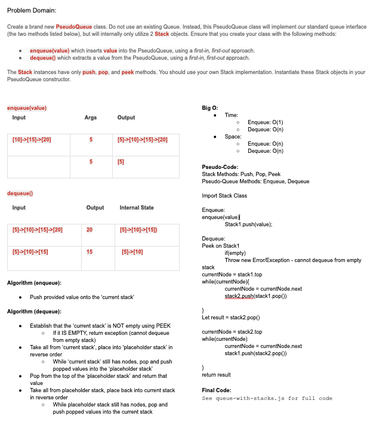

# Queue Implementation with Stacks

### **[LINK TO CODE](https://github.com/alex-whan/data-structures-and-algorithms/blob/master/javascript/challenges/queueWithStacks/queue-with-stacks.js)**

## Challenge

Implement a Queue using two Stacks. Create a brand new `PseudoQueue` class. Do not use an existing Queue. Instead, this PseudoQueue class will implement a standard queue interface (the two methods listed below), but will internally only utilize 2 Stack objects. Ensure that you create your class with the following methods: `enqueue()` and `dequeue()`. The Stack instances within the PseudoQueue will have the `push()`, `pop()`, and `peek()` methods, and will be instantiated within the PseudoQueue constructor.

Implement the following methods:

- `enqueue(value)`: Takes in argument `value` and inserts it into the PseudoQueue, using a first-in, first-out approach.

- `dequeue`: Extracts a value from the PseudoQueue, using a first-in, first-out approach.

## Input/Output Examples

`enqueue(value)`

| Input            | Args | Output                |
| ---------------- | ---- | --------------------- |
| [10]->[15]->[20] | 5    | [5]->[10]->[15]->[20] |
| []               | 5    | [5]                   |

`dequeue()`

| Input                 | Args | Output          |
| --------------------- | ---- | --------------- |
| [5]->[10]->[15]->[20] | 20   | [5]->[10]->[15] |
| [5]->[10]->[15]       | 15   | [5]->[10]       |

## Approach & Efficiency

### Big O Time:

`enqueue()` & `dequeue()`: O(1)

### Big O Space:

`enqueue()` & `dequeue()`: O(1)

## Diagrams & Solutions

### Whiteboard

