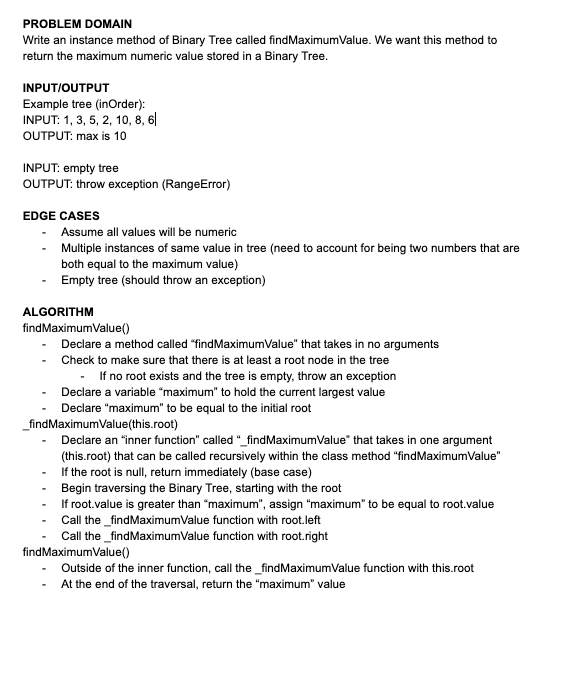
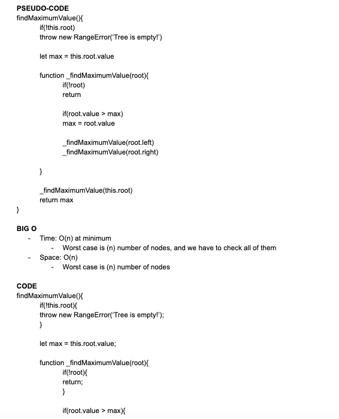
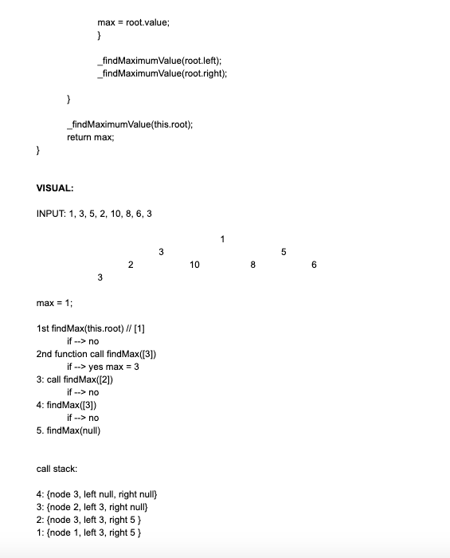

# Trees

### **[LINK TO CODE](https://github.com/alex-whan/data-structures-and-algorithms/blob/master/javascript/data-structures/tree/tree.js)**

## Challenge

Create a `Node` class that has properties for the value stored in the node, the left child node, and the right child node.

Create a `BinaryTree` class, and define a method for each of the depth first traversals called `preOrder`, `inOrder`, and `postOrder` which returns an array of the values, ordered appropriately.

Create a `BinarySearchTree` class, and define a method named `add` that accepts a value, and adds a new node with that value in the correct location in the binary search tree.

Define a method named `contains` that accepts a value, and returns a boolean indicating whether or not the value is in the tree at least once.

See below for further information on method functionality.

## Approach & Efficiency

### Big O Time:

#### Binary Tree

- `preOrder()`: O(n)
- `inOrder()`: O(n)
- `postOrder()`: O(n)
- `findMaximumValue()`: O(n)

#### Binary Search Tree

- `add()`: O(n)
- `contains()`: O(n)

### Big O Space:

#### Binary Tree

- `preOrder()`: O(1)
- `inOrder()`: O(1)
- `postOrder()`: O(1)
- `findMaximumValue()`: O(1)

#### Binary Search Tree

- `add()`: O(1)
- `contains()`: O(1)

## API

### Available Methods

#### Binary Tree

- `preOrder()`: A depth-first traversal method for a binary tree that searches/prints an array of tree values as such: `root >> left >> right`.

- `inOrder()`: A depth-first traversal method for a binary tree that searches/prints an array of tree values as such: `left >> root >> right`.

* `postOrder()`: A depth-first traversal method for a binary tree that searches/prints an array of tree values as such: `left >> right >> root`.

* `findMaximumValue()`: Takes no argument, and returns the maximum numeric value stored in the tree.

#### Binary Search Tree

- `add(value)`: Accepts a value, and adds a new node with that value in the correct location in the binary search tree.

- `contains(value)`: Accepts a value, and returns a boolean indicating whether or not the value is in the tree at least once.

## Diagrams

### Whiteboard: findMaxmimumValue() Method

